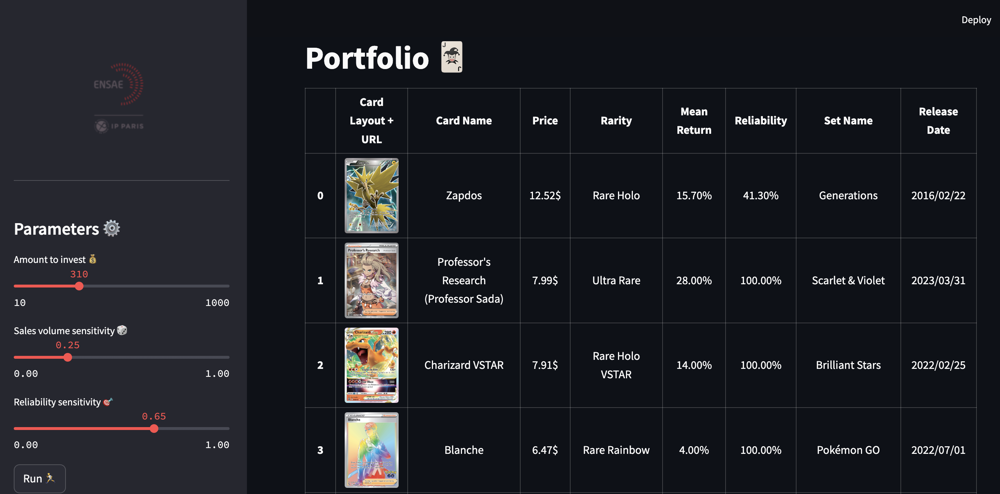
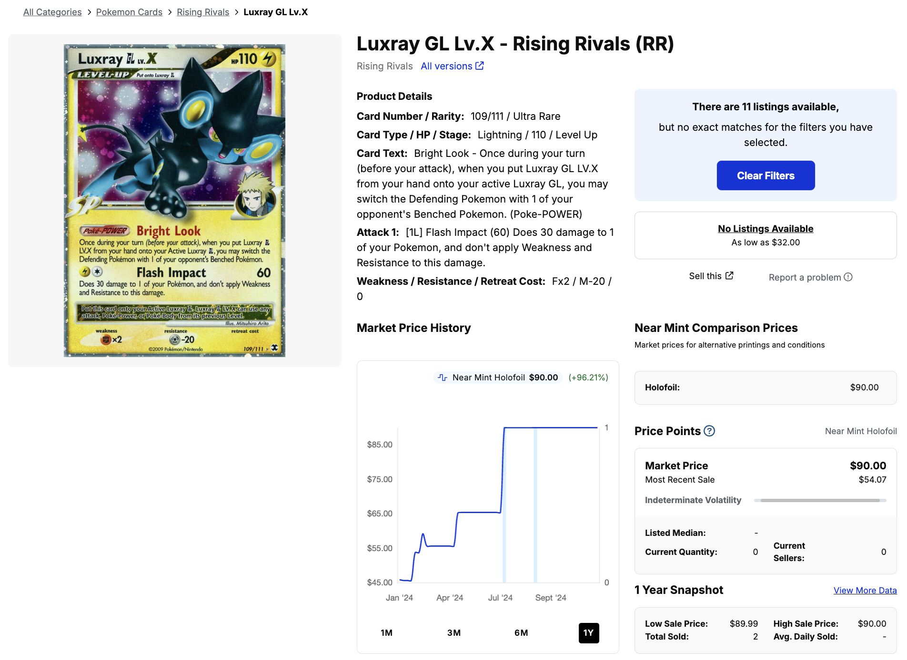
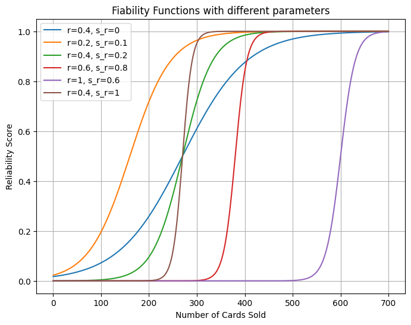
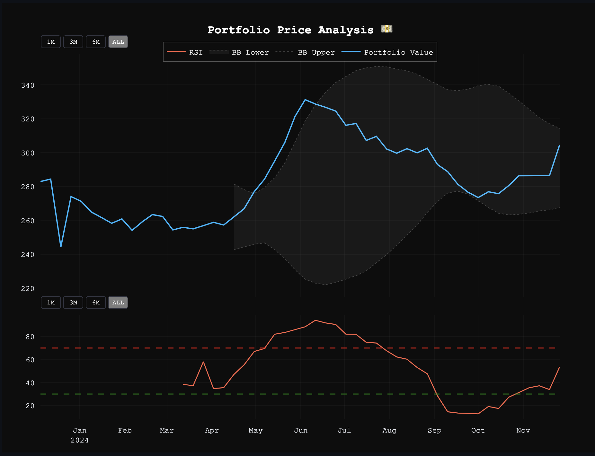
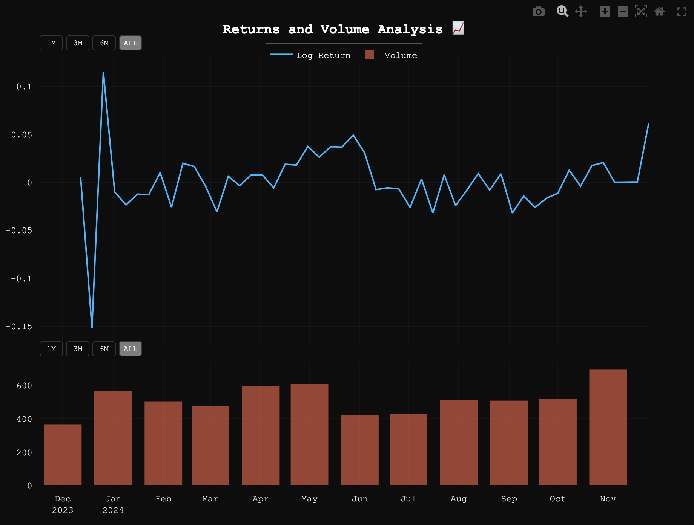
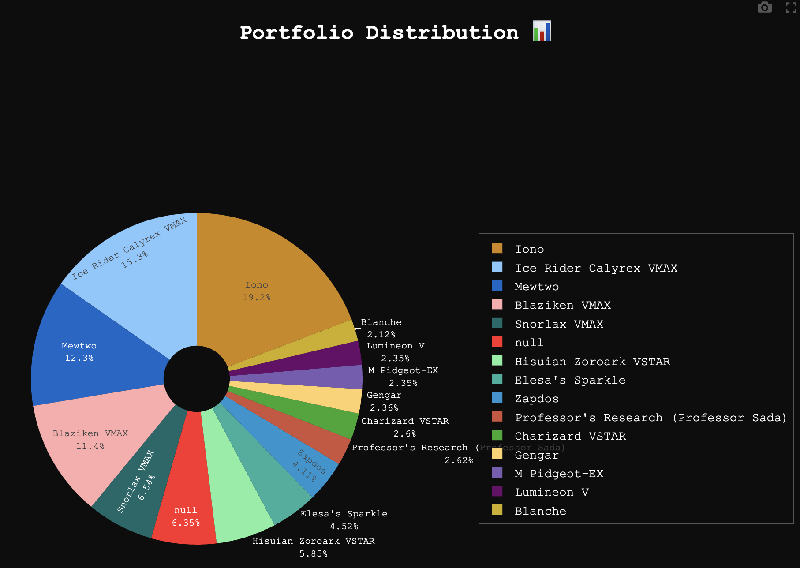

# Pokemon Card Investment Portfolio 🃏

With the emergence of the new Pokemon App (Pokemon TCGPlayer) and the growing popularity of the franchise, Pokemon has reached its peak in 2024. The latest card collections have become increasingly expensive, as many people seek to profit from collecting them, turning these cards into genuine investment assets.

This project aims to create an **investment portfolio for Pokémon cards** by leveraging historical price trends and financial modeling. 

The main objective is to execute all key steps of a data science project, from data scraping and analysis to statistical modelling, culminating in the visualisation and presentation of results.

Here is an example of the interface !



Here is the structure of the project : 
- Data Scraping from [TCGPlayer](https://www.tcgplayer.com/search/pokemon/product?productLineName=pokemon&page=1&view=grid) 🛠️
-  Data Analysis & Statistics 🔎
-  Portfolio Optimization with Markowitz Model 🧠
-  Visualization & Results 📈


❗️**Disclaimer**❗️ 
This project is for educational purposes only. We strongly advise against using this model for actual Pokémon card investments. 
<p align="center"><strong>Past performance does not predict future results.</strong></p>


This project was completed during the Engineering Program at [**ENSAE Paris**](https://www.ensae.fr/en), Master's level (first year)

## Code Architecture

- `main.ipynb` : Main notebook for project exploration and execution.
- `requirements.txt` : Dependencies and package installation requirements.
- `analysis.ipynb` : Statistical analysis and data exploration of Pokemon cards.

- `datas/` :  
    - `pokemon_cards.csv` : The primary CSV file containing comprehensive information on all Pokemon cards.
    - `pokemon_data_popularity` : Dataset ranking the top 240 Pokemon by popularity.
    - `price_history/` : Directory containing ~3,600 individual card price history files.
- `PokemonCardManager.py` : Card information extraction and processing module. Updates `pokemon_cards.csv` with new card data.

- `GetHistoricCardPrices.py` : Price history extraction module for all cards listed in `pokemon_cards.csv`.

- `UsefulFunctionsForModels.py` : Utility functions supporting the Markowitz Portfolio Optimization Model.

- `MarkowitzPortfolioOptimizer.py` : Implementation of the Markowitz Model adapted for Pokemon card trading with binary weights.
- `PlotsStreamlit.py` : Visualization functions for Streamlit dashboard and portfolio analysis.
- `streamlit.py` : Interactive web dashboard for portfolio presentation using Streamlit framework.

## Run locally

Clone the project :

```bash
  git clone https://github.com/nayelsdk/Quantitative_Portfolio_Pokemon_Card.git
```

To install all the requirements locally in a virtual environment, please use the `requirements.txt` file : 
```bash
  pip install requirements
```


You can try this project with : 
- `main.ipynb` : everything is already set-up !
- `streamlit.py` : run this code to have an interactive interface to build your portfolio.

On the terminal, use the command line : 
```bash
  streamlit run streamlit.py
```

## Data Scraping from TCGPlayer 🛠️

### `pokemon_cards.csv`
This section aims to provide a concise explanation of how we scraped all Pokémon cards and generated the primary dataset, `pokemon_cards.csv`.

**Data Source :**
We utilized the PokemonTCGPlayer API (https://api.pokemontcg.io/v2/cards) to extract data. Specifically, we scraped the first 250 pages of Pokémon cards listed on the platform, focusing on cards valued above $5. This filtering ensures that the dataset includes cards with a minimum monetary value.

**Dataset Contents :**
The resulting CSV file contains the following columns:

- `id`: Unique identifier for each card
- `name`: Name of the card
- `rarity`: Rarity level of the card
- `collection`: Set or collection to which the card belongs
- `series`: Card series
- `holofoil_price`: Price of the holofoil version
- `reverse_holofoil_price`: Price of the reverse holofoil version
- `release_date`: Release date of the card
- `nationalPokedexNumbers`: Associated Pokédex number(s)
- `artist`: Illustrator of the card
- `images_url`: URL to the card's images
- `popularity_rank`: Popularity ranking of the card


### `price_history`
This file contains the complete price history for the various extracted Pokémon cards. Each CSV file includes the following columns: `Dates`, `price_history`, `quantity_sold` (Number of cards sold over a specific period)


For each card, we accessed the URL `https://prices.pokemontcg.io/tcgplayer/{id}` using **ChromeDriver**. From this page, we extracted a unique price history for each card, focusing on cards in Near Mint condition (i.e., pristine condition). For more details on card conditions, see this [guide](https://help.tcgplayer.com/hc/en-us/articles/221430307-How-can-I-tell-what-condition-a-card-is-in?_gl=1*ndr0ag*_gcl_au*MTI4MTI4Nzk2LjE3MzEyNzg1OTYuMjA4MjY3NzExNC4xNzMxMjgwNzA2LjE3MzEyODI1NjM.*_ga*NjY1ODU1NjkzLjE3MzEyNzg1OTY.*_ga_VS9BE2Z3GY*MTczNDkxMDA4NS45My4wLjE3MzQ5MTAwODUuNjAuMC4w).

Additionally, we focused on the highest price for each rarity type (Holofoil, Reverse Holofoil, Normal).

The extraction process was conducted using **BeautifulSoup** and **Selenium**, as it required interacting with multiple buttons on the webpage to retrieve the desired condition and rarity data. The price history spans one year.

_Note_: Each card takes approximately 1 minute and 30 seconds to extract. If you plan to run the code, be prepared to allocate sufficient time. ⏳ ☠️
##  Data Analysis & Statistics 🔎
We have conducted an in-depth analysis of the pokemon_cards database, examining various characteristics and correlations among different parameters including artists, rarity levels, and popularity rankings. 

All analyses are documented in the `analysis.ipynb` notebook.

## Portfolio Optimization with Markowitz Model 🧠

For portfolio modeling, it was preferable to first implement a constrained minimization model inspired by Markowitz's framework.  

We have approximately 3600 extracted cards. The goal is to create a portfolio of 5 to 35 Pokémon cards for an investor based on :

- $M$ : investment amount in 💲
- $s_r$ : the risk sensitivity parameter, a value between 0 and 1:  
  - If $s_r = 0$, the curve is very smooth, indicating low sensitivity to risk.  
  - If $s_r = 1$, the curve becomes steep, indicating high risk aversion.  
- $r$ : the risk aversion parameter, also a value between 0 and 1:  
  - If $r = 0$, less frequently traded cards are considered.  
  - If $r = 1$, only highly traded cards are considered.  


Each card is assigned its average annual logarithmic return and a reliability score, which will be explained later.  

In fact, each card can not be considered with the same risk (the price can drasticly reduce because the card is not "hype").

#### 2 Examples :
 
This card is not very satisfactory as only a few people have traded it. While it shows a nice mean return, this data is not reliable enough for the project's purposes.

 
Here, this is much better. The price history is much more reliable for this card.


### Logarithmic Return Formula  
The logarithmic return is calculated as: 

$$ 
R_t = \log\left(\frac{P_t}{P_{t-1}}\right) 
$$  

The average logarithmic return is then defined as:  

$$
R_{\text{mean}} = \frac{1}{T} \sum_{t=1}^{T} R_t
$$

Where:  
- $R_{\text{mean}}$ is the mean logarithmic return.  
- $T$ is the number of logarithmic returns for the card.  
- $R_t$ represents the logarithmic return at iteration \(t\).  

### Reliability Score  
In addition to the mean return, the reliability score for each card is defined as:  

$$
Reliability = \frac{1}{1 - e^{-k \cdot (x - x_0)}}  
$$  

Where :
- $$k = (MAX_K - MIN_K) \cdot s_r + MIN_K$$
    - $MAX_K = 0.1$ 
    -  $MIN_K = 0.015$
- $x_0 = (MAX_X - MIN_X) \cdot r + MIN_X$
    - $MAX_X = 600$
    - $MIN_X = 30$ 


### Why Use the Sigmoid Function?  
To justify the use of the sigmoid function, here is a graph illustrating how reliability scores vary with different parameters:  



The closer $s_r$ gets to 1, the more we assign a penalizing (rewarding) score for high (low) numbers of sales. Conversely, $r$ represents the sales volume threshold where we wish to apply this gap.


 

 **The goal here is to eliminate or reduce the visibility of cards with few sales and let the investor choose.** Cards with few sales typically show step-like functions, which is not realistic at all, and we cannot trust such cards (examples of cards to be added).

From there, we keep all cards that meet the following criteria:

$$
Reliability \cdot R_{mean} > 0.01 
$$

And :

$$
 Price < 0.4 \cdot M
$$

### Markowitz Model Adaptation


We now have a selection of $N$ cards that will allow us to build our portfolio. From these cards, we extract their price history over the year to determine their covariance matrix denoted $\Sigma$.

We then solve the minimization problem:

$$
\min_{w_1,\dots, w_N} w^T \cdot \Sigma \cdot w
$$

Subject to the constraint:

$$
w_1 + w_2 + \dots + w_N = 1
$$

Where : 
- $w_1 \dots w_N$ are the optimal weights from the Markowitz model

**Choice of Markowitz Model** : Other models for choosing $w_i$ exist, such as Monte Carlo, genetic algorithms, or price prediction models using time series approaches. The goal of this project was to first test a simple method for a portfolio that minimizes risk while providing relatively satisfactory returns, without considering parameters other than price (upcoming Pokémon Company events, future game release dates, etc.). A prediction model was also difficult to implement directly given the significant number of cards with few sales. Even when a card had many sales, the data is collected weekly, which ultimately provides very little data (about fifty prices). We would need to continue storing future price history for several more weeks and then work exclusively with these cards, but this goes beyond the project's scope.

Markowitz was interesting to discover simple asset management models used in management companies1. More advanced models like Black-Litterman could have been tried but time was lacking...

**Portfolio Construction :** After determining the weights of these $N$ cards, we select $n$ cards that will compose our portfolio. To do this, we fill the portfolio by maximizing the sum of our $w_i$ while staying within a budget constraint of ±15%.

$$
Portfolio = \{Card_1, \dots, Card_n\}
$$

Subject to the following constraints:

   $$
   w_1, \dots, w_n = \max_{w_1, \dots, w_N} w_i
   $$
   
   $$
   0.85 \cdot M < \sum_{i=1}^{n} Price_{Card_{i}} < 1.15 \cdot M
   $$

## Visualization & Results 📈

Now comes the time to visualize the Pokémon card portfolio. We chose to use **Streamlit** for its user-friendly interface and aesthetic appeal.


We also implemented financial indicators to make it as close as possible to a real investment advisor.

Let's look at a concrete example, the same one used to build the portfolio at the beginning of the `README`: 


| Parameters used   |               |
| ----------------- | ------------- |
| Amount to invest 💰 | 310 ($)|
| Sales volume sensitivity 🎲 | 25%|
| Reliability sensitivity 🎯 | 65%|

#### Portfolio Price Analysis 💵
Dans ce graphe, on peut observer l'historique passé d'un an du prix du portefolio que le modèle de Markowitz propose. 
Dans le but d'ajouter quelques informations supplémentaires sur le portefeuille, nous avons ajouté deux indicateurs techniques : 

#### Relative Strength Index (RSI)

The Relative Strength Index - $RSI$ - is a momentum indicator that oscillates between 0 and 100, measuring whether an asset is overbought or oversold. 
In our portfolio analysis, it helps determine if the current portfolio position is overextended in either direction, signaling potential buying or selling opportunities.
- If $RSI>70$ : the portfolio is considered "overbought" - prices may be too high and could decline.
 
- If $RSI<30$ : the portfolio is considered "oversold" - prices may be too low and could rebound.

**$RSI$ Formula :**

$$
RSI = 100 - \frac{100}{1 + \frac{G}{L}}
$$

Where : 
- $G$ : average gains over the selected period
- $L$ : average losses over the selected period (absolute value)

#### Bollinger Bands (BB)

Bollinger Bands (BB) is a tool used to analyze periods of varying volatility in the portfolio. When the bands are wide apart, volatility is higher and prices are more likely to make significant moves. Conversely, when the bands are tight, volatility is lower and price movements tend to be more contained.

They are composed of :

$$
BB_{upper} = SMA + 2 \cdot Std \\
$$

And

$$
BB_{lower} = SMA - 2 \cdot Std
$$

Where :
- $SMA$ : Simple Moving Average of prices over the 15-period window.
- $Std$ : Standard deviation of prices over the 15-period window.



_Note:_ 
- RSI : The graph shows that the portfolio experienced a significant uptrend between April and June 2024 (both price and $RSI$ increased), followed by a gradual decline until October, before slightly recovering in November.
- BB : 
  - Between May and August 2024, the bands significantly widened as your portfolio rose from 260 to 330, indicating a period of high volatility.
  - From September to November 2024, the bands were narrow, indicating a period of low volatility.


#### Returns and Volume Analysis 📈




#### Portfolio Distribution 📊
Finally, we propose a pie chart representing the distribution of cards in the portfolio as a function of their price.




## Model Limitations

This Pokémon card investment project has several areas that warrant further exploration and improvement:

#### Backtesting Needs
The model currently lacks proper **backtesting validation**. A more robust approach would involve comparing portfolio performance using different time windows - for example, calculating average returns over 9 months versus 12 months. Additionally, past performance does not guarantee future results, making our Markowitz-based approach, which relies solely on historical prices, insufficient for real investment decisions. Time series prediction methods, as mentioned in the **Choice of Markowitz Model:** section, could provide more sophisticated forecasting.

#### Technical Issues
Some cards display step-function behavior in their prices, potentially leading to infinite theoretical returns. While this can be addressed by adjusting the $MIN_X$ parameter, we've kept the current settings for demonstration purposes.


#### Data Management Challenges
The data collection process could be enhanced through:
- Cloud-based automated price updates
- Regular synchronization with current market data
- Systematic storage and maintenance of historical price data

The price history was locally extracted between November and early December 2024, missing subsequent price updates. Furthermore, the current system faces potential display issues in the Streamlit interface when updating the pokemon_cards.csv database, as some cards might disappear from the dataset.

## Acknowledgements

We would like to acknowledge Professor [Lino Galiana](https://www.linogaliana.fr/), ENSAE Paris, for his course of _Python For Data Science_. We also thank [Victor Quétu](https://www.linkedin.com/in/victor-qu%C3%A9tu/), PhD student at Télécom Paris and teaching assistant for this course.


### Contributors 


[BENABDESADOK Nayel](https://www.linkedin.com/in/nayel-benabdesadok)
[KEFI Wassim](https://www.linkedin.com/in/wassim-kefi-01a57829a)
[REN Alexandre](https://www.linkedin.com/in/alexandre-ren-a53a04292)
